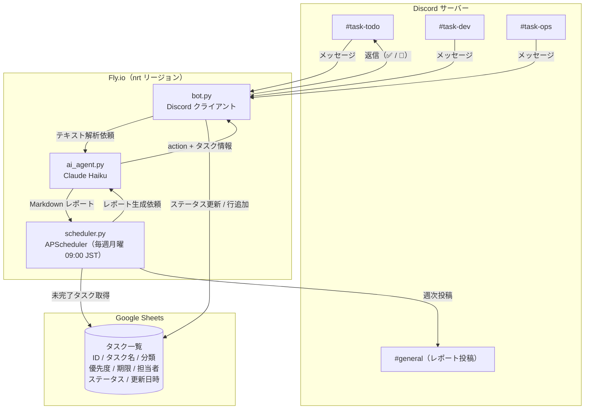
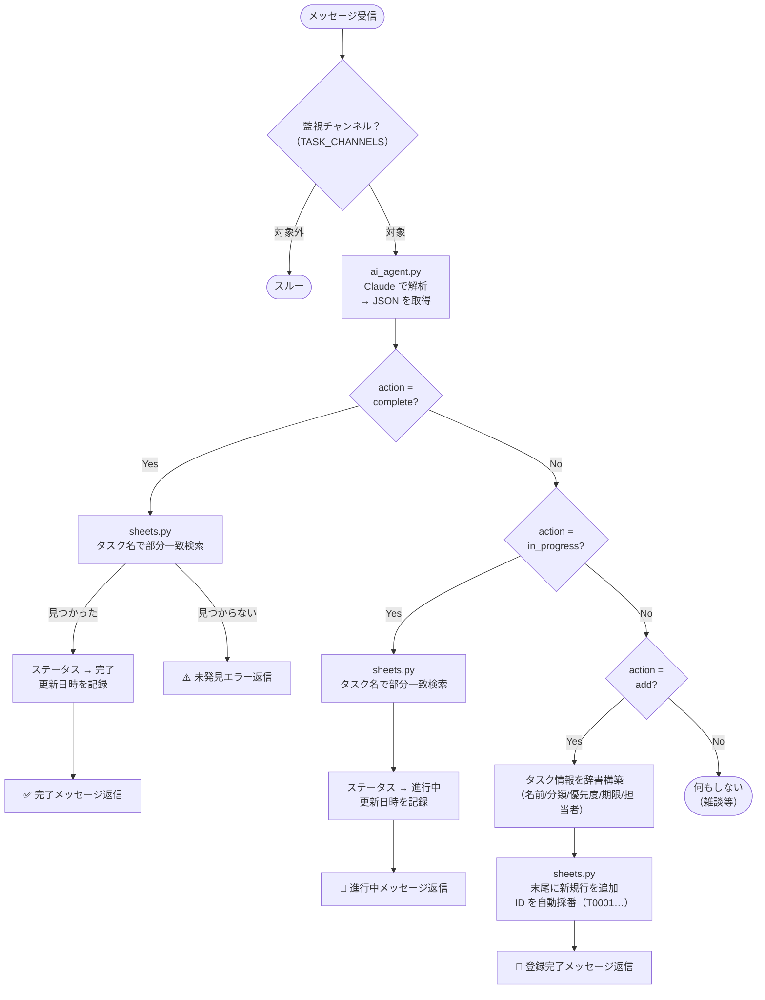
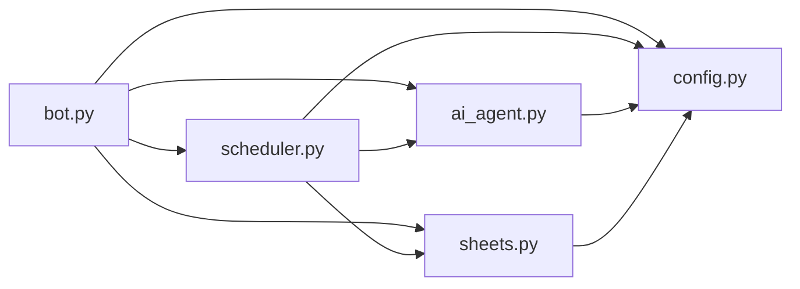
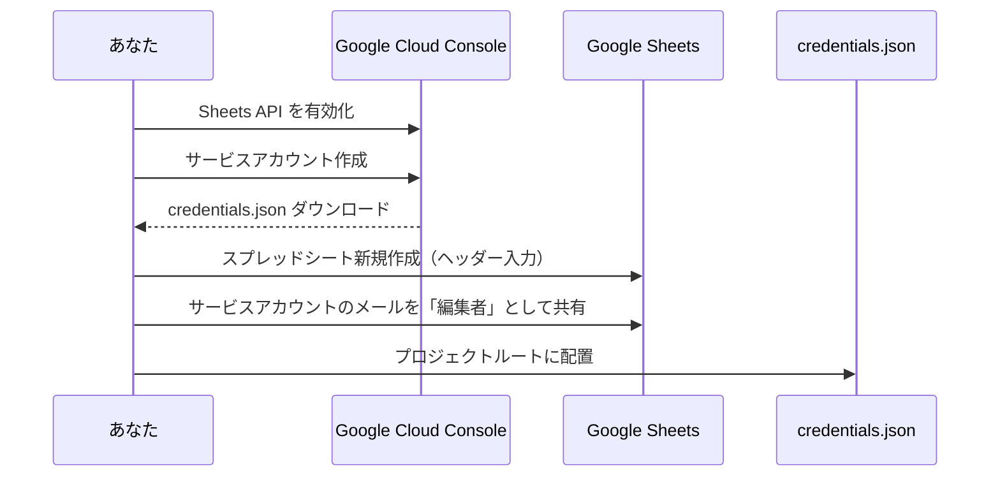

# Discord タスク管理Bot

Discord の複数チャンネルを監視し、投稿されたメッセージを AI（Claude）が解析してタスクの完了・追加を自動処理します。毎週月曜朝に AI 生成の進捗レポートを Discord に投稿します。

- **ホスティング**: Fly.io（無料〜$5/月）
- **AI エンジン**: Claude Haiku（$1〜3/月）
- **データストア**: Google Sheets（無料）
- **合計目安**: $1〜$8/月

---

## システム構成



---

## メッセージ処理フロー



---

## プロジェクト構成

```txt
discord-task-bot/
├── src/
│   ├── __init__.py
│   ├── bot.py          # Discord イベント処理・起動エントリポイント
│   ├── ai_agent.py     # Claude API 呼び出し・メッセージ解析・レポート生成
│   ├── sheets.py       # Google Sheets CRUD 操作
│   ├── scheduler.py    # 週次リマインド（APScheduler）
│   └── config.py       # 環境変数・定数管理
├── Dockerfile          # python:3.11-slim ベース
├── fly.toml            # Fly.io デプロイ設定（nrt リージョン）
├── requirements.txt    # 依存パッケージ
├── credentials.json    # Google サービスアカウントキー（git 管理外）
└── .env.example        # 環境変数テンプレート
```

### モジュール依存関係



---

## Google スプレッドシート構造

| 列 | 内容 | 例 |
| --- | --- | --- |
| A | ID（自動採番） | T0001 |
| B | タスク名 | ○○機能の実装 |
| C | 分類 | 開発 |
| D | 優先度 | 高 / 中 / 低 |
| E | 期限 | 2026/03/31 |
| F | 担当者 | Tomo |
| G | ステータス | 未着手 / 進行中 / 完了 |
| H | 更新日時 | 2026/03/14 09:00 |

> スプレッドシートの 1 行目に上記ヘッダーを手動で入力してください。

---

## 使い方

### タスクの完了報告（監視チャンネルに投稿）

```txt
○○機能の実装 完了しました
バグ修正レビュー終わった done
```

Bot が返信します：
> ✅ **○○機能の実装** を「完了」に更新しました！

### タスクの進捗更新

```txt
○○タスク着手します
バグ修正レビュー 進行中
```

### タスクの新規追加

```txt
追加: 決算レポート作成、期限2026/03/31、担当Tomo、優先度高
タスク: バグ修正レビュー 来週中
```

Bot が返信します：
> 📝 **決算レポート作成** を登録しました！  
> 　ID: `T0005` ／ 優先度: 高 ／ 期限: 2026/03/31 ／ 担当: Tomo

### 週次レポート（自動）

毎週月曜 09:00 JST に `REPORT_CHANNEL` へ自動投稿されます。

```txt
【週次タスクリマインド】2026/03/16

未完了タスク 5件 / 担当: Tomo(3件) Sato(2件)

⚠️ [高] 決算レポート作成 — Tomo / 期限 3/18（2日後）
　 [高] API 設計レビュー — Sato / 期限 3/21
　 [中] ドキュメント更新 — Tomo / 期限 未設定

_週次リマインド from タスクBot_
```

---

## セットアップ手順

### 1. Discord Bot 作成

1. [Discord Developer Portal](https://discord.com/developers/applications) にアクセス
2. **New Application** → 名前を入力して作成
3. **Bot** タブ → **Reset Token** でトークンをコピー（一度しか表示されません）
4. **Privileged Gateway Intents** で `MESSAGE CONTENT INTENT` を有効化
5. **OAuth2 → URL Generator** で以下を選択してサーバーに招待
   - Scopes: `bot`
   - Permissions: `Read Messages/View Channels`, `Send Messages`, `Read Message History`

### 2. Google Sheets + サービスアカウント



### 3. 環境変数の設定

```bash
cp .env.example .env
# .env を編集して各値を入力
```

`.env.example` の内容：

```dotenv
DISCORD_TOKEN=your_discord_bot_token_here
TASK_CHANNELS=task-todo,task-dev,task-ops   # カンマ区切り（空=全チャンネル）
REPORT_CHANNEL=general                      # 週次レポートの投稿先
ANTHROPIC_API_KEY=your_anthropic_api_key_here
SPREADSHEET_ID=your_spreadsheet_id_here
SHEET_NAME=タスク一覧
CREDENTIALS_FILE=credentials.json
```

### 4. Fly.io へデプロイ

```bash
# flyctl のインストール（未インストールの場合）
# https://fly.io/docs/hands-on/install-flyctl/

# ログイン
flyctl auth login

# アプリ初期化（fly.toml の app 名が自動設定されます）
flyctl launch --no-deploy

# 機密情報をシークレットとして登録
flyctl secrets set DISCORD_TOKEN="your_token"
flyctl secrets set ANTHROPIC_API_KEY="your_key"
flyctl secrets set SPREADSHEET_ID="your_id"
flyctl secrets set TASK_CHANNELS="task-todo,task-dev,task-ops"
flyctl secrets set REPORT_CHANNEL="general"
flyctl secrets set GOOGLE_CREDENTIALS="$(cat credentials.json)"

# デプロイ
flyctl deploy

# ログ確認
flyctl logs
```

> **重要**: `credentials.json` は `.gitignore` に追加してください。

---

## コスト目安（月額）

| 項目 | 無料枠 | 超過時 |
| --- | --- | --- |
| Fly.io shared-cpu-1x 256MB | 3台まで無料 | $5/月〜 |
| Google Sheets API | 500 req/日 | 無料のまま使用可 |
| Claude API (Haiku) | なし | ~$0.80/100万トークン |
| **合計** | **$0〜** | **$1〜$8/月** |

Claude Haiku の消費トークン目安（1ヶ月）:

- メッセージ解析 × 200回 → 約 60,000 トークン
- 週次レポート生成 × 4回 → 約 8,000 トークン
- 合計: **約 70,000 トークン ≒ $0.06**（ほぼ無視できるコスト）

---

## 依存パッケージ

| パッケージ | バージョン | 用途 |
| --- | --- | --- |
| discord.py | 2.3.2 | Discord Bot フレームワーク |
| anthropic | 0.34.2 | Claude API クライアント |
| google-api-python-client | 2.143.0 | Google Sheets API |
| google-auth | 2.34.0 | Google 認証 |
| APScheduler | 3.10.4 | 週次スケジューラ |
| python-dotenv | 1.0.1 | 環境変数読み込み |
